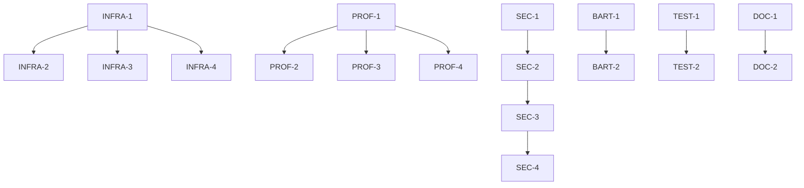

# Systems Flake Reorganization - Project Tickets

## Epic 1: Core Infrastructure Modernization
**Goal**: Establish basic modular structure and improve maintainability
**Timeline**: ~2-3 weeks

### Milestone 1.1: Module System Foundation (1 week)
- [ ] INFRA-1: Create base module directory structure
  - Priority: High
  - Effort: 2h
  - Create `modules/{nixos,darwin,home}` directories
  - Add README.md with module guidelines

- [ ] INFRA-2: Move desktop configurations to modules
  - Priority: High
  - Effort: 4h
  - Dependencies: INFRA-1
  - Extract common desktop settings from marshmallow/total-eclipse
  - Create `modules/nixos/desktop/default.nix`

- [ ] INFRA-3: Move development configurations to modules
  - Priority: High
  - Effort: 4h
  - Dependencies: INFRA-1
  - Extract dev tools and settings
  - Create language-specific modules

- [ ] INFRA-4: Create Darwin-specific modules
  - Priority: High
  - Effort: 4h
  - Dependencies: INFRA-1
  - Extract common MacOS configurations
  - Create homebrew integration module

### Milestone 1.2: Profile System Implementation (1 week)
- [ ] PROF-1: Create profile directory structure
  - Priority: High
  - Effort: 2h
  - Set up `profiles/` directory
  - Create profile documentation template

- [ ] PROF-2: Implement personal machine profile
  - Priority: High
  - Effort: 4h
  - Dependencies: PROF-1
  - Extract common personal machine configs
  - Test with marshmallow

- [ ] PROF-3: Implement server profile
  - Priority: High
  - Effort: 4h
  - Dependencies: PROF-1
  - Extract rich-evans base configuration
  - Document server-specific requirements

- [ ] PROF-4: Implement gaming profile
  - Priority: Medium
  - Effort: 4h
  - Dependencies: PROF-1
  - Extract total-eclipse gaming optimizations
  - Document graphics/performance settings

## Epic 2: Security and Secrets Management
**Goal**: Improve system security and secrets handling
**Timeline**: ~1-2 weeks

### Milestone 2.1: Basic Secrets Infrastructure (3 days)
- [ ] SEC-1: Set up SOPS infrastructure
  - Priority: High
  - Effort: 4h
  - Create initial SOPS configuration
  - Generate necessary keys

- [ ] SEC-2: Create secrets organization structure
  - Priority: High
  - Effort: 2h
  - Dependencies: SEC-1
  - Define secrets categories
  - Create documentation for secrets management

### Milestone 2.2: Secrets Migration (4 days)
- [ ] SEC-3: Migrate existing secrets to SOPS
  - Priority: High
  - Effort: 6h
  - Dependencies: SEC-1, SEC-2
  - Move current secrets to new structure
  - Validate all services still work

- [ ] SEC-4: Implement backup strategy for secrets
  - Priority: Medium
  - Effort: 4h
  - Dependencies: SEC-3
  - Create backup procedures
  - Document recovery process

## Epic 3: Machine-Specific Optimizations
**Goal**: Address individual machine needs and improvements
**Timeline**: ~2-3 weeks

### Milestone 3.1: Server Optimization (1 week)
- [ ] SERV-1: Rich-Evans service organization
  - Priority: High
  - Effort: 6h
  - Organize existing services into modules
  - Document service dependencies

- [ ] SERV-2: Implement monitoring
  - Priority: Medium
  - Effort: 6h
  - Set up Prometheus/Grafana
  - Create basic dashboards

### Milestone 3.2: Desktop Improvements (1 week)
- [ ] DESK-1: Marshmallow development environment
  - Priority: High
  - Effort: 6h
  - Optimize dev tools configuration
  - Improve shell environment

- [ ] DESK-2: Total-Eclipse gaming optimizations
  - Priority: Medium
  - Effort: 4h
  - Review and optimize gaming settings
  - Document performance tweaks

### Milestone 3.3: Legacy Hardware Support (3 days)
- [ ] BART-1: Bartleby boot sector fix
  - Priority: High
  - Effort: 4h
  - Investigate boot partition issues
  - Implement long-term solution

- [ ] BART-2: Bartleby resource optimization
  - Priority: Medium
  - Effort: 4h
  - Dependencies: BART-1
  - Optimize for limited resources
  - Document performance improvements

## Epic 4: Testing and Documentation
**Goal**: Ensure system reliability and maintainability
**Timeline**: ~2 weeks

### Milestone 4.1: Testing Infrastructure (1 week)
- [ ] TEST-1: Set up basic test framework
  - Priority: Medium
  - Effort: 6h
  - Create test directory structure
  - Implement basic system tests

- [ ] TEST-2: Create critical configuration tests
  - Priority: Medium
  - Effort: 6h
  - Dependencies: TEST-1
  - Test core system functionality
  - Test common user scenarios

### Milestone 4.2: Documentation (1 week)
- [ ] DOC-1: Create system documentation
  - Priority: High
  - Effort: 6h
  - Document system architecture
  - Create setup guides

- [ ] DOC-2: Create maintenance guides
  - Priority: Medium
  - Effort: 4h
  - Dependencies: DOC-1
  - Document common tasks
  - Create troubleshooting guides

## Notes on Implementation
- Each ticket should be implemented in a separate branch
- PRs should include:
  - Configuration changes
  - Documentation updates
  - Test cases (where applicable)
- All major changes should be tested on a non-critical system first
- Consider creating a staging environment for testing

## Priority Definitions
- High: Required for system stability/security
- Medium: Important for usability/maintenance
- Low: Nice to have/quality of life

## Effort Estimates
- Based on single developer working time
- Does not include review/testing time
- Should be refined based on actual implementation experience

## Dependencies Graph
