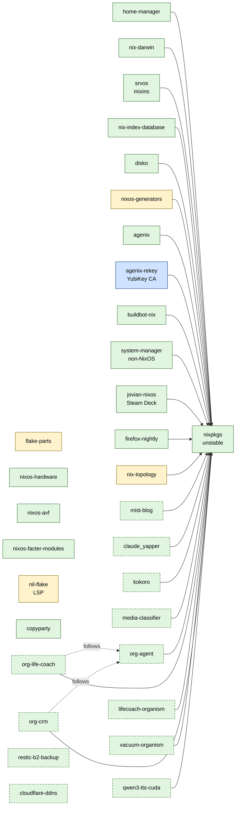
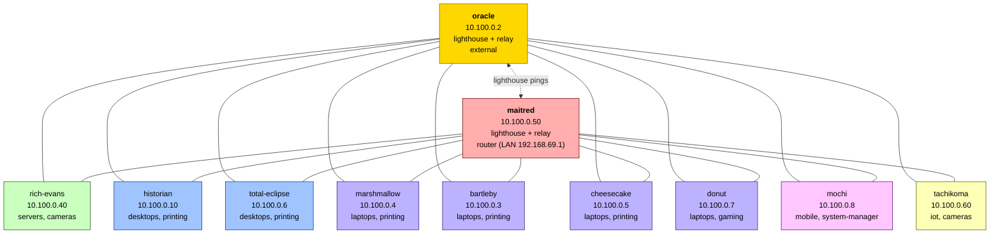
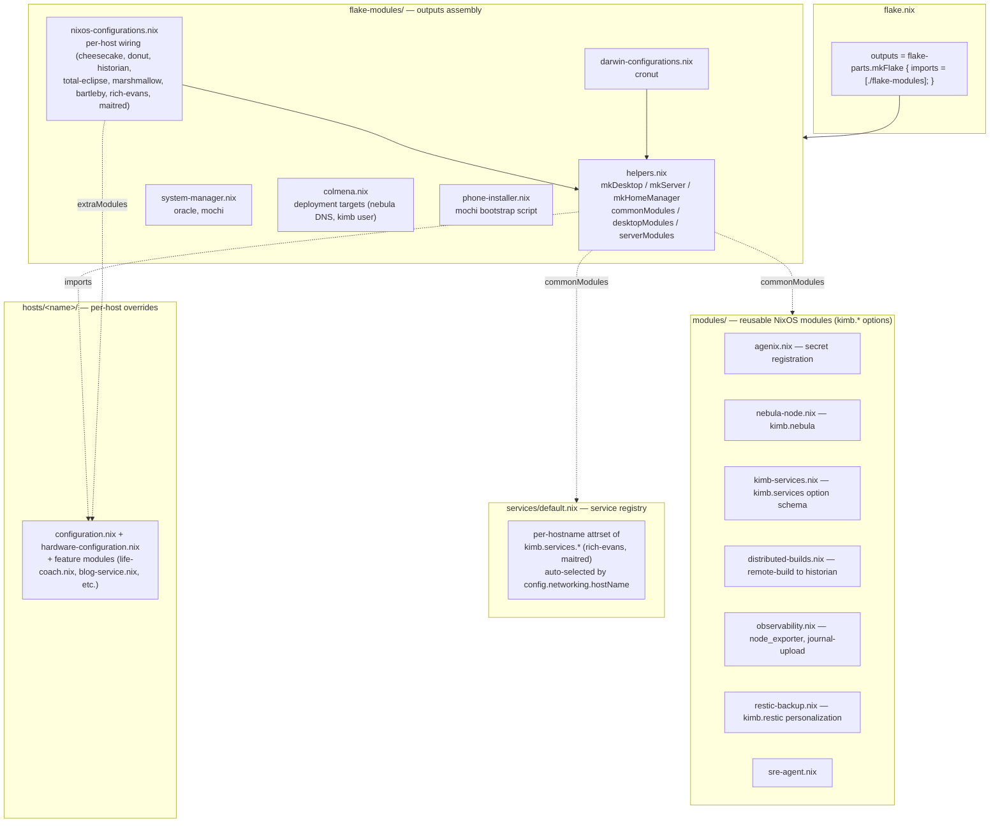

# systems-flake Architecture Map

Top-level map of the systems-flake repo. This is the **map**, not the audit —
security findings live in [sf-h30], hygiene in [sf-sex], test coverage in [sf-e5q].

Cross-reference:
- [docs/ARCHITECTURE.md](ARCHITECTURE.md) — reference manual (schemas, "how to add a host", file index)
- This document — input graph, host taxonomy, nebula topology, module composition, ingress map

## 1. Flake Input Graph

All `mccartykim/*` private inputs use `git+https://` so the buildbot worker's
fine-grained PAT (`/var/lib/buildbot-worker/.netrc`) can authenticate the fetch.
`ssh://` would need an SSH key on the worker; the `github:` short-form would use
`archive/<rev>.tar.gz`, which fine-grained PATs cannot read.



**Legend**

| Class | Meaning |
|---|---|
| Green | Runtime: NixOS module is wired into one or more host configurations |
| Yellow | Dev-only: appears in dev shell, flake checks, formatter, LSP, or topology rendering — not in any system closure |
| Blue | Both: agenix is runtime (decrypts on hosts); agenix-rekey is also dev-tool side (YubiKey-driven re-encryption) |
| Dashed border | Private (`mccartykim/*`) git+https input |

**Dev-only inputs**

- `flake-parts`, `nil-flake`, `nixos-generators`, `nix-topology` — composition / tooling / diagrams
- `nixos-facter-modules` — only currently consumed by `cheesecake` (facter report path); arguably runtime there

**Runtime-only mccartykim/* consumers** (where each private input lands)

| Input | Consumed by | Host(s) |
|---|---|---|
| `mist-blog` | maitred blog container | maitred |
| `claude_yapper` | rich-evans `life-coach.nix` | rich-evans |
| `kokoro` | rich-evans (TTS) | rich-evans |
| `media-classifier` | historian (Jellyfin library) | historian |
| `org-agent` | transitive dep of org-life-coach + org-crm | rich-evans |
| `org-life-coach` | rich-evans `org-life-coach.nix` | rich-evans |
| `lifecoach-organism` | rich-evans `lifecoach-organism.nix` | rich-evans |
| `vacuum-organism` | rich-evans `vacuum-organism.nix` | rich-evans |
| `org-crm` | rich-evans `org-crm.nix` | rich-evans |
| `qwen3-tts-cuda` | not yet wired into any host (input present, no module import) | — |
| `restic-b2-backup` | personalized by `modules/restic-backup.nix` (host-opt-in) | hosts with `kimb.restic.enable` |
| `cloudflare-ddns` | maitred `dns-update.nix` | maitred |

## 2. Host Taxonomy

| Host | Role | OS variant | Nebula IP | LAN / external | Hardware | Agent(s) / notable modules |
|---|---|---|---|---|---|---|
| **oracle** | lighthouse + relay | system-manager (Ubuntu) | 10.100.0.2 | external `150.136.155.204:4242` | Oracle Cloud VM (x86_64) | nebula lighthouse, system-manager agenix bridge |
| **maitred** | router + reverse proxy + lighthouse | NixOS | 10.100.0.50 | LAN `192.168.69.1`; external `kimb.dev:4242` | Datto 1000 (repurposed MSP appliance) | Caddy, Authelia, Prometheus, Grafana, mist-blog container, cloudflare-ddns, homepage, tor-relay, monitoring-probes |
| **rich-evans** | server | NixOS (srvos.server) | 10.100.0.40 | home LAN | HP Mini PC | Home Assistant, Matrix (conduit), copyparty, buildbot-master, claude_yapper, org-life-coach, lifecoach-organism, vacuum-organism, org-crm, email-digest, kokoro TTS |
| **historian** | desktop (daily driver + remote builder) | NixOS (srvos.desktop) | 10.100.0.10 | home LAN | Beelink SER5 Max (Ryzen 7 5800H APU) | Jellyfin, media-classifier, distributed-builds target, buildbot-worker |
| **total-eclipse** | desktop (gaming) | NixOS (srvos.desktop) | 10.100.0.6 | home LAN | Costco gaming PC (RTX 4060) | gaming profile |
| **marshmallow** | laptop (T490) | NixOS (srvos.desktop) | 10.100.0.4 | mobile | ThinkPad T490 | nixos-hardware lenovo-thinkpad-t490 |
| **bartleby** | laptop (college) | NixOS (srvos.desktop) | 10.100.0.3 | mobile | ThinkPad E131 | nil-flake overlay, fractal-art (disabled) |
| **cheesecake** | laptop / tablet | NixOS (srvos.desktop) | 10.100.0.5 | mobile | Surface Go 3 | nixos-facter-modules |
| **donut** | laptop (handheld gaming) | Jovian NixOS | 10.100.0.7 | mobile | Steam Deck | jovian-nixos overlay |
| **mochi** | mobile (phone) | system-manager (Debian on AVF) | 10.100.0.8 | mobile | Pixel 9 Pro (AVF) | nebula (postboot); bootstrap via `phone-installer.nix` |
| **tachikoma** | IoT (robot vacuum) | Valetudo (not Nix-managed) | 10.100.0.60 | home LAN | Dreame vacuum + Valetudo | nebula via postboot, certs in `/data/nebula_cfg` |
| **cronut** | desktop (macOS) | nix-darwin | — (not on nebula) | mobile | Mac | home-manager, nix-index-database |

**Observed gaps for follow-up beads (not fixed here)**

- `qwen3-tts-cuda` is declared as a flake input but no host imports it.
- `tachikoma` has `publicKey = null` in the registry and is excluded from agenix re-encryption — managed entirely out-of-band.
- `cronut` is in `darwinConfigurations` but absent from `nebula-registry.nix`, so it has no agenix host key and no Nebula identity.

## 3. Nebula Mesh Topology

Two lighthouses (`oracle`, `maitred`) for redundancy after the GCE lighthouse
(10.100.0.1) was retired due to egress costs. Both are also relays. LAN
discovery is enabled (`192.168.69.0/24` preferred over relay for local pairs).



**Groups (from `hosts/nebula-registry.nix`)**

| Group | Members |
|---|---|
| `lighthouse` | oracle |
| `routers` | maitred |
| `servers` | rich-evans |
| `desktops` | historian, total-eclipse |
| `laptops` | marshmallow, bartleby, cheesecake, donut |
| `mobile` | mochi |
| `iot` | tachikoma |
| `cameras` | rich-evans, tachikoma |
| `printing` | historian, total-eclipse, marshmallow, bartleby, cheesecake |
| `nixos` | all NixOS hosts (everything except oracle, mochi, tachikoma) |
| `system-manager` | oracle, mochi |

**Firewall convention** (`modules/nebula-node.nix`)

- `kimb.nebula.openToPersonalDevices = true` opens all ports to `desktops` and
  `laptops` groups — used by servers and the router so personal devices have
  full access.
- `kimb.nebula.extraInboundRules` adds host-specific exceptions (e.g.
  `{ port = 80; proto = "tcp"; host = "any"; }`).

**LAN preference** — nebula is configured to prefer direct LAN connections
(`192.168.69.0/24`) over relay routing for lower latency between local hosts.

## 4. Module Composition

Four layers, applied outside-in:



**Where does each kind of customization belong?**

| Kind | Location | Composition mechanism |
|---|---|---|
| Cross-cutting NixOS option (`kimb.*`) | `modules/*.nix` | imported via `commonModules` in `flake-modules/helpers.nix` |
| Service definition (port, subdomain, auth, host) | `services/default.nix` | auto-injected via `commonModules`; picked up by `config.networking.hostName` |
| Per-host config that uses those options | `hosts/<name>/configuration.nix` | passed to `mkDesktop`/`mkServer` as the host file |
| Host-specific feature module | `hosts/<name>/<feature>.nix` | imported from `configuration.nix` or via `extraModules` in `nixos-configurations.nix` |
| Hardware quirks (Lenovo T490, Surface Go, Steam Deck) | `hardwareModules` arg to `mkDesktop` | passed alongside `nixos-hardware` modules in `nixos-configurations.nix` |
| Profile (desktop, server, gaming, base, i3) | `hosts/profiles/*.nix` | imported by individual host `configuration.nix` files |
| Home-manager per host | `home/<hostname>.nix` | auto-wired by `mkHomeManager` (default path) or overridden |
| Darwin (macOS) | `darwin/<hostname>/configuration.nix` | listed explicitly in `flake-modules/darwin-configurations.nix` |
| Non-NixOS host (Ubuntu, Debian) | `hosts/<name>/configuration.nix` + `flake-modules/system-manager.nix` | `system-manager.lib.makeSystemConfig` |

**`mkDesktop` composition order (outside-in)**

```
desktopModules           (srvos.desktop + mixins-nix-experimental + mixins-trusted-nix-caches)
++ commonModules         (nix-index-database, distributed-builds, agenix, sre-agent,
                          observability, kimb-services, services/default.nix,
                          python+firefox overlays, nix-topology, nebula extraHosts)
++ hardwareModules       (caller-provided: nixos-hardware.*, srvos mixins, facter, etc.)
++ ["hosts/<name>/configuration.nix"]
++ mkHomeManager { ... } (home-manager.nixosModules.home-manager + users.kimb)
++ extraModules          (caller-provided: feature modules, overrides)
```

`mkServer` is the same shape with `serverModules` (srvos.server + same mixins +
`mixins-systemd-boot`) and no home-manager by default.

The router (`maitred`) is **not** built with `mkServer` — it bypasses the helper
to inject `kimb.domain`/`kimb.admin`/`kimb.networks`/`kimb.dns` directly so it
can act as the source of truth for the rest of the network.

`donut` (Steam Deck) also bypasses `mkDesktop` to pull in the `jovian-nixos`
module + overlay before the host config.

## 5. Public Ingress Map

All public ingress terminates at **maitred** (`kimb.dev:443`). Caddy handles
TLS via Let's Encrypt (wildcard for `*.kimb.dev`), routes by subdomain, and
either serves the reverse-proxy container locally or proxies over Nebula to
the actual backend host.

```
Internet → kimb.dev:443 → maitred (Caddy)
                       ├─ local container (reverse-proxy at 192.168.100.2)
                       └─ nebula → backend host : service port
```

| Public hostname | Terminates at | Backend host | Backend port | Auth | WebSockets | Source |
|---|---|---|---|---|---|---|
| `auth.kimb.dev` | maitred | maitred | 9091 | none (auth itself) | — | `services/default.nix:maitred.authelia` |
| `grafana.kimb.dev` | maitred | maitred | 3000 | authelia | — | `services/default.nix:maitred.grafana` |
| `prometheus.kimb.dev` | maitred | maitred | 9090 | authelia | — | `services/default.nix:maitred.prometheus` |
| `home.kimb.dev` | maitred | maitred | 8082 | authelia | — | `services/default.nix:maitred.homepage` |
| `home-rich.kimb.dev` | maitred (proxied) | rich-evans | 8082 | none | — | `services/default.nix:rich-evans.homepage` (internal-only via `publicAccess=false`) |
| `blog.kimb.dev` | maitred | maitred container `192.168.100.3` | 8080 | none | — | `services/default.nix:maitred.blog` (mist-blog) |
| `www.kimb.dev` | maitred | maitred container `192.168.100.2` | 80 | none | — | `services/default.nix:maitred.reverse-proxy` |
| `files.kimb.dev` | maitred (proxied) | rich-evans | 3923 | authelia | — | `services/default.nix:rich-evans.copyparty` |
| `hass.kimb.dev` | maitred (proxied) | rich-evans | 8123 | builtin | yes | `services/default.nix:maitred.homeassistant` |
| `matrix.kimb.dev` | maitred (proxied) | rich-evans (conduit) | 6167 | builtin | yes | `services/default.nix:maitred.matrix` |
| `media.kimb.dev` | maitred (proxied) | historian (Jellyfin) | 8096 | builtin | yes | `services/default.nix:maitred.jellyfin` |
| `buildbot.kimb.dev` | maitred (proxied) | rich-evans (buildbot-master) | 80 | none | yes | `services/default.nix:maitred.buildbot` |
| `coach.kimb.dev` | maitred (proxied) | rich-evans (lifecoach-organism) | 8586 | authelia | — | `services/default.nix:maitred.life-coach-dashboard` |

**Notes**

- `publicAccess = false` services (e.g. `home-rich`) still get a Caddy
  vhost on maitred but are restricted to LAN / Nebula / Tailscale CIDRs
  by Caddy IP matching (see `modules/kimb-services.nix` and
  `hosts/maitred/reverse-proxy.nix`).
- The auth ladder is `none` → `builtin` (service's own login, e.g. Matrix
  conduit) → `authelia` (SSO via `auth.kimb.dev`).
- Dynamic DNS is driven by `cloudflare-ddns` on maitred updating the
  apex `kimb.dev` A record only — subdomains resolve via the wildcard.
- The `life-coach-dashboard` entry appears under both `rich-evans` and
  `maitred` in `services/default.nix`. On rich-evans it registers the
  local service; on maitred it registers the proxy vhost. Both must
  agree on port (`8586`); a drift here would land in the hygiene audit.

[sf-h30]: # "systems-flake security audit"
[sf-sex]: # "systems-flake hygiene survey"
[sf-e5q]: # "systems-flake test coverage audit"
